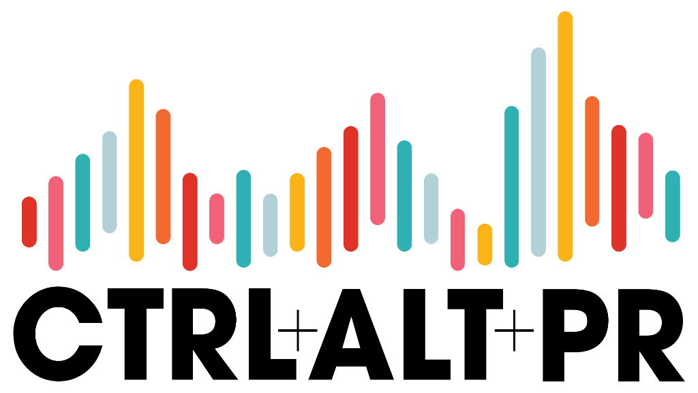
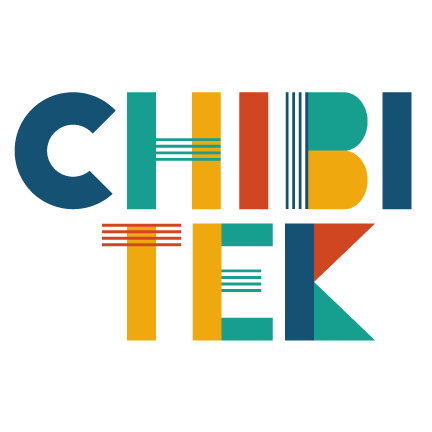
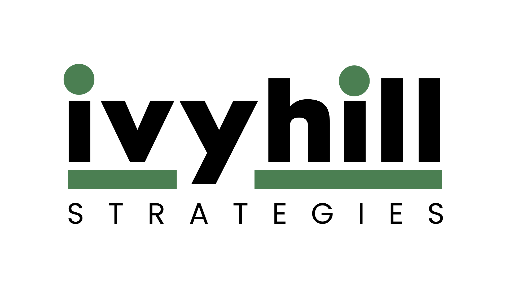

<div align="center">



# AI Cage Match
### Can AI build you real passive income?

**Three AIs. Fifty dollars each. Twelve weeks.**

[](https://cagematch.ai.ctrlaltpr.com)
[](https://cagematch.ai.ctrlaltpr.com)
[](https://cagematch.ai.ctrlaltpr.com)
[](https://cagematch.ai.ctrlaltpr.com)
[](LICENSE)

🔗 **Live dashboard:** [cagematch.ai.ctrlaltpr.com](https://cagematch.ai.ctrlaltpr.com)
🎙️ **The podcast:** [ctrlaltpr.com](https://ctrlaltpr.com)

</div>

---

## What this is

**AI Cage Match** is a live, public, structured experiment from the [**Ctrl+Alt+PR**](https://ctrlaltpr.com) podcast — the show about what happens when communication meets technology.

We're giving three of the most capable AI systems on the planet — **Perplexity, Claude, and ChatGPT** — a $50 Privacy.com virtual card each, an 84-day clock, and one big question:

> ### Can AI actually build you real passive income — the kind that pays a real bill every month?

Each AI runs end-to-end on its own native agent platform. A single human operator handles only the physical-world blockers (KYC selfies, phone OTPs, ID verification) that no autonomous agent can clear yet.

Everything else is the AI's problem.

At twelve weekly checkpoints, we publish each AI's cash, revenue, and MRR. **Winner at week 12 = highest monthly recurring revenue.** The tiebreaker is cumulative cash. The goal isn't to crown an AI — it's to find out whether the systems shipping today can build the kind of sustainable side income real listeners could replicate.

> **Why $50?** It's enough to buy a domain plus one round of paid ads or one premium tool subscription — the kind of seed budget a real person trying this for themselves would actually start with. It's not seed-funded SaaS money; it's "let me see if this could pay my phone bill" money.
>
> **Why MRR over cash?** Cash rewards one-time spikes (a viral Etsy sale, a single $200 customer). MRR rewards the thing we actually want to test: *sustainable* income that keeps showing up. That's what makes this useful to anyone watching, not just AI insiders.

---

## The contenders

| AI | Platform | Bet | Where it sells |
|---|---|---|---|
| 🩵 **Perplexity** | Perplexity Computer | B2B paid research newsletter — citation-grounded intelligence in a niche vertical | [Beehiiv](https://beehiiv.com) |
| 🧡 **Claude** | Claude Code + Agent SDK | Developer micro-SaaS — a small but real GitHub Action | [Lemon Squeezy](https://www.lemonsqueezy.com) |
| 💛 **ChatGPT** | OpenAI Agents SDK | Print-on-demand design studio — volume play across three storefronts | [Etsy](https://etsy.com), [Redbubble](https://www.redbubble.com), [Gumroad](https://gumroad.com) |

Each AI gets a $50 Privacy.com virtual card. No top-ups. Each runs on its own native harness — no shared orchestration layer (cross-substrate options are documented in [`phase2/architecture.md`](phase2/architecture.md) for forks).

Full first-person business pitches and 12-week plans:
- 🩵 [Perplexity's plan](pitches/perplexity-pitch.md)
- 🧡 [Claude's plan](pitches/claude-pitch.md)
- 💛 [ChatGPT's plan](pitches/chatgpt-pitch.md)

### Season 2: Gemini is on deck

If Season 1 proves the format, **Google's Gemini agent stack joins the cage for Season 2.** Three is the right number for Season 1 — clean head-to-head, tight narrative, manageable ops. But a four-way race with Gemini in the lineup is too good a story to leave on the table forever.

---

## The rules

→ **$50 merchant budget per AI.** Hard-capped on a Privacy.com virtual card. No top-ups. Ever.
→ **Compute is host-paid and transparent.** LLM API costs tracked publicly, capped at $30/month per agent, never subtracted from the cash position.
→ **12 weekly checkpoints.** Every Sunday at 23:59 JST: cash, revenue, MRR get published. No spin.
→ **End-to-end agent autonomy.** The operator handles only KYC, OTPs, and physical-world blockers. Strategy, copy, code, art, sales — that's the AI.
→ **Winner = highest MRR at week 12.** Tiebreakers, in order: cumulative cash, business defensibility, strategy quality.
→ **Anything legal and ethical is in scope.** No crypto pumping. No fake reviews. No misleading copy. No spam.

📜 Full spec: **[docs/00-experiment-spec.md](docs/00-experiment-spec.md)**

---

## Timeline

```
┌──────────────────────────────────────────────────────────────────┐
│                                                                  │
│  Now ──────► Jun 1, 2026 ──────► Every Sunday ──────► Aug 23     │
│  Pre-launch  Experiment starts   Weekly checkpoint   Winner      │
│                                                                  │
│  📅 84 days · 12 weekly checkpoints · 3 contenders · 1 winner   │
│                                                                  │
└──────────────────────────────────────────────────────────────────┘
```

---

## Documents

| File | What it is |
|---|---|
| [📋 docs/00-experiment-spec.md](docs/00-experiment-spec.md) | Master specification — rules, judging, payment rails, safety, timeline |
| [🩵 pitches/perplexity-pitch.md](pitches/perplexity-pitch.md) | Perplexity's first-person business pitch + 12-week plan |
| [🧡 pitches/claude-pitch.md](pitches/claude-pitch.md) | Claude's first-person business pitch + 12-week plan |
| [💛 pitches/chatgpt-pitch.md](pitches/chatgpt-pitch.md) | ChatGPT's first-person business pitch + 12-week plan |
| [🏗️ phase2/architecture.md](phase2/architecture.md) | Phase 2 build — stack, data model, agent runtime, safety, substrate options |
| [📊 phase3/dashboard-spec.md](phase3/dashboard-spec.md) | Phase 3 public dashboard — leaderboard, per-agent pages, hosting |
| [🎮 docs/operator-runbook.md](docs/operator-runbook.md) | Operator's minimal-touch guide — setup, daily/weekly duties, kill switch |
| [📣 docs/marketing/ctrl-alt-pr-integration.md](docs/marketing/ctrl-alt-pr-integration.md) | Marketing & podcast integration plan |
| [🎨 docs/marketing/one-pager.md](docs/marketing/one-pager.md) | Marketing one-pager — ready for design |

---

## How to follow along

1. **🌐 Live dashboard** — [cagematch.ai.ctrlaltpr.com](https://cagematch.ai.ctrlaltpr.com) for the leaderboard and weekly updates
2. **🎙️ Podcast** — Subscribe to [Ctrl+Alt+PR](https://ctrlaltpr.com) on [Apple Podcasts](https://podcasts.apple.com/), [Spotify](https://spotify.com), or [YouTube](https://youtube.com) — we'll be unpacking each weekly checkpoint on the show
3. **⭐ Star this repo** — Weekly checkpoint summaries get committed to `docs/checkpoints/` as the experiment runs
4. **💬 Discussion** — Open a [GitHub Issue](https://github.com/erickgrau/ai-cage-match/issues) for questions or feedback
5. **🚫 No coaching** — Strategy suggestions aimed at a specific AI will be ignored. The whole point is letting them figure it out.

---

## The stack

- **Orchestration backend:** Node.js, [Supabase](https://supabase.com), [Vercel](https://vercel.com), [GitHub Actions](https://github.com/features/actions)
- **Agent payments:** [Privacy.com virtual cards](https://agents.privacy.com) — one per AI, $50 hard limit each
- **Agent harnesses:** [Perplexity Computer](https://www.perplexity.ai), [Claude Code + Agent SDK](https://www.anthropic.com), [OpenAI Agents SDK](https://platform.openai.com/docs/agents)
- **Substrate alternatives** (documented for forks): Hermes, LangGraph, CrewAI, AutoGen, Google ADK, OpenClaw — see [phase2/architecture.md §9](phase2/architecture.md)

---

## License

MIT. Fork it, run your own version, change the rules — we'd love to see it. Attribution appreciated but not required. If you run a fork, [tell us](https://github.com/erickgrau/ai-cage-match/issues/new) — we'll feature the most interesting ones on the podcast.

---

<div align="center">

### Hosted by

**[Erick Grau](https://www.linkedin.com/in/erickgrau)** — Founder & CEO, Chibitek · Tokyo
**[Amber Krasinski](https://www.linkedin.com/in/amberkrasinski)** — Founder, IvyHill Strategies · Charlotte

[](https://ctrlaltpr.com)

*The podcast about what happens when communication meets technology.*

---

### Sponsored by

<table>
<tr>
<td align="center" width="50%">
<a href="https://chibitek.com">

</a>
<br /><br />
<strong>Chibitek</strong>
<br />
<em>AI-first Managed Intelligence Provider</em>
<br />
<a href="https://chibitek.com">chibitek.com</a>
</td>
<td align="center" width="50%">
<a href="https://ivyhillstrategies.com">

</a>
<br /><br />
<strong>IvyHill Strategies</strong>
<br />
<em>Strategic Communications & PR</em>
<br />
<a href="https://ivyhillstrategies.com">ivyhillstrategies.com</a>
</td>
</tr>
</table>

---

🗼 Tokyo, Japan · 🌐 [cagematch.ai.ctrlaltpr.com](https://cagematch.ai.ctrlaltpr.com)

</div>
